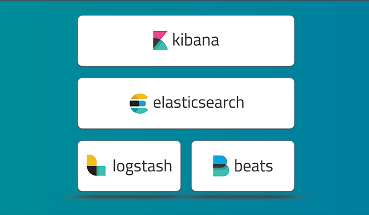

# for the local run
'pip install flask requests'
or explicitly 
'python3.11 -m pip install flask requests'

# install minikube on windows https://minikube.sigs.k8s.io/docs/start/?arch=%2Fwindows%2Fx86-64%2Fstable%2F.exe+download

run pover shell as admin

Download and run the installer for the latest release.
Or if using PowerShell, use this command:

`New-Item -Path 'c:\' -Name 'minikube' -ItemType Directory -Force
Invoke-WebRequest -OutFile 'c:\minikube\minikube.exe' -Uri 'https://github.com/kubernetes/minikube/releases/latest/download/minikube-windows-amd64.exe' -UseBasicParsing`

Add the minikube.exe binary to your PATH.
Make sure to run PowerShell as Administrator.

`$oldPath = [Environment]::GetEnvironmentVariable('Path', [EnvironmentVariableTarget]::Machine)
if ($oldPath.Split(';') -inotcontains 'C:\minikube'){
[Environment]::SetEnvironmentVariable('Path', $('{0};C:\minikube' -f $oldPath), [EnvironmentVariableTarget]::Machine)
}`

# run minikube
docker context use default
minikube start --driver=docker --cpus=4 --memory=16g; minikube addons enable storage-provisioner; minikube addons enable default-storageclass
minikube status

minikube addons enable metrics-server; minikube dashboard

# build artifacts (for publishing read how to publish them in artifactory)
powerschell (troubleshooting for using locally built images in minikube) > minikube -p minikube docker-env | Invoke-Expression

or in my repo

docker build -t pong-service .\services\pong\.  
docker tag pong-service:latest arxemond777/pong-service:latest  
docker push arxemond777/pong-service:latest  
kubectl apply -f services/pong/pong-deployment.yaml  

docker build -t ping-service .\services\ping;  
docker tag ping-service:latest arxemond777/ping-service:latest;  
docker push arxemond777/ping-service:latest  

# after restarting the PC
1) minikube stop  
2) minikube delete  
3) minikube start --driver=docker --host-only-cidr "192.168.99.1/24"  
4) minikube dashboard  

# setup logs (filebeat > elasticsearch > kibana)

0) install helm  
1) helm repo add elastic https://helm.elastic.co  
   helm repo update    
2) installing elasticsearch and port-forward  
helm install elasticsearch elastic/elasticsearch  -f infra/elk/elasticsearch-values.yaml --namespace=elk  --create-namespace --wait  
kubectl port-forward service/elasticsearch-master 9200  --namespace=elk

use 127.0.0.1:9200/ (pay attention to http://localhost:9200/ must be http not httpS in your browser)
and login in it
the login is "elastic"  
extract the pass "kubectl get secret elasticsearch-master-credentials -o go-template='{{.data.password | base64decode}}' -n elk"
or "PASSWORD=$(kubectl get secret elasticsearch-master-credentials -o go-template='{{.data.password | base64decode}}' -n elk')"

### create am index for elasticsearch
http://localhost:5601/app/home#/ > search > data views > create data view >   
name - any_name  
indexPattern - filebeat-*

3) installing filebeat and kibana

helm install kibana elastic/kibana --namespace=elk --wait
kubectl port-forward deployment/kibana-kibana 5601 --namespace=elk

use 127.0.0.1:5601/login?next=%2F (attention: pay attention to http://localhost:5601/login?next=%2F must be http not httpS in your browser
the pass for logging in kibana is the same

helm install filebeat elastic/filebeat --namespace=elk -f infra/elk/filebeat.yaml --wait

## ping-deployment.yaml & pong-deployment.yaml - are Kubernetes deployment YAML files
## ping-service.yaml & pong-service.yaml - for network detecting, load balancing, pod discovery
## todo use .\redeploy-ping-pong.bat

### if needs to remove
kubectl delete deployment ping-deployment  
kubectl delete deployment pong-deployment

### curling inside of kuber
kubectl delete pod curlpod --namespace=myapp
kubectl run curlpod --image=curlimages/curl --restart=Never --namespace=myapp -- sleep infinity
kubectl exec -it curlpod --namespace=myapp -- /bin/sh  
curl http://ping-service:5000/health  
curl http://pong-service:5001/health  
curl http://pong-service:5001/metrics  
curl http://pong-service.myapp.svc.cluster.local:5001/metrics  

# trash delete later
docker build -t app:latest .

docker tag pong-service:latest arxemond777/app:latest
docker push arxemond777/app:latest
kubectl apply -f app-deploy.yaml

